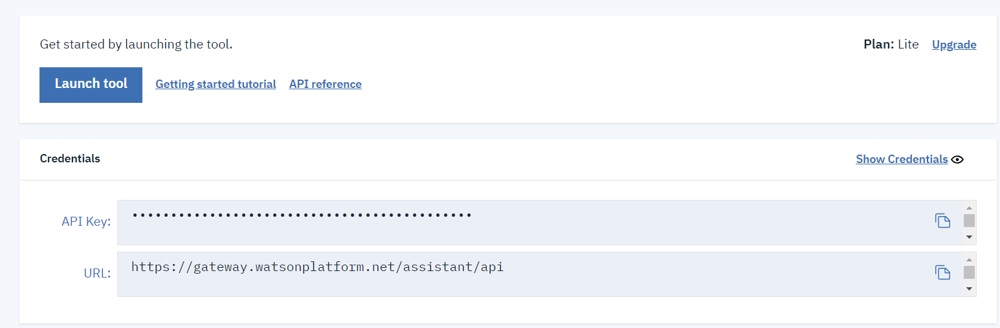
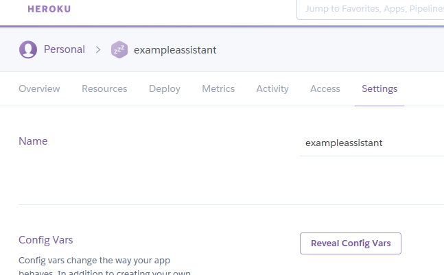
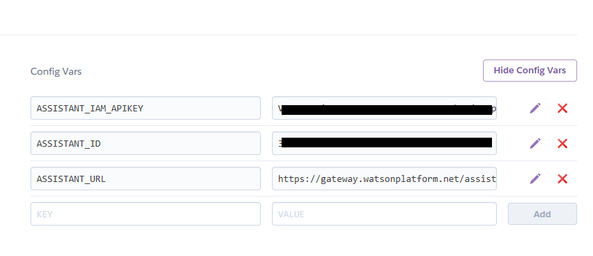

# IBM Watson Assistant Web Application
This repository is to outline a sample Watson Assistant application that can be found at:

https://exampleassistant.herokuapp.com/

This application is a working example of an open source sample Watson application with a few tweaks in order to solely outline the functionality of the application. The original repository information can be found [here.](https://github.com/watson-developer-cloud/assistant-simple)

[Watson Assistant](https://www.ibm.com/cloud/watson-assistant) is an IBM Rest API that combines machine learning, language understanding, and other dialog tools to create conversation flows between apps and users. The purpose of this app is to showcase the Watson abilities in a mock banking environment. It provides the user the ability to interact with an AI that communicates with the user to assist with questions regarding banking information.

## Necessities

The sample code was developed in a Linux based environment (Ubuntu 16.04) and requires that [Node JS](https://nodejs.org/en/) and [Docker](https://www.docker.com/) be installed to run a working application.

## Docker
```bash
    $ sudo apt-get install docker.io
```
Verify Docker installation

```bash
    $ docker --version
```
## Node JS
```bash
    $ sudo apt-get update
    $ sudo apt-get install node js
```
You will also need to install 'npm':
```bash
    $ sudo apt-get install npm
```
Verify that both are working properly

```bash
    $ node -v
```
and
```bash
    $ npm -v
```

It also requires an [IBM Cloud account registration](https://console.bluemix.net/registration/) in order to commission a Watson Assistant instance.
A [Heroku](https://www.heroku.com/) account is also needed to deploy the application in order to deploy the application, as well as the Heroku CLI for the Heroku git.

## Heroku
```bash
    $ sudo snap install --classic heroku
```
and verify.

```bash
    $ heroku --version
```
## Clone the GitHub repository
```bash
    $ git clone https://github.com/cjjaramillo/marist-mscs621-jaramillo
```
## Sign into your IBM Cloud account
 * In the Catalog create a Watson Assistant instance 
 * Copy the API Credentials under the **Manage** tab as you will need to reference this later
 
 * Go into your instance and **Add Skill**
 * Click on import skill and navigate in your host machine to *<project root>/training/bank_simple_workspace.json* and select **Add Everything**
 * Select the option to now add your skill to an Assistant
 * After you've created an Assistant with the banking skill, View the API details for the assistant and copy the information that you will also need later
## In your project folder.. 
 * Create a *.env* file
```bash
    $ touch .env
```
that contains the following:
```bash
ASSISTANT_ID=<API Key for the Assistant which you copied in the previous step>
ASSISTANT_IAM_APIKEY=<API Key for the original Watson Assistant instance you obtained earlier>
ASSISTANT_URL=https://gateway.watsonplatform.net/assistant/api (or whatever URL is was displayed when you created the instance)   
```
## Run your code locally

Install your dependencies
```bash
    $ npm install
```
Run your app
```bash
    $ npm start
```
You can now view your application in a web browser at localhost:3000

## Create your docker image to deploy 
Be sure you have your Dockerfile configured first, then
```bash
    $ docker build -t <image name> .
```
Run locally on port 3000
```bash
    $ docker run -it -p 3000:3000 --rm --name <instance> <image>
```
## Deploy to Heroku
First, add your variables to your Heroku account



Then deploy to Heroku
```bash
    $ heroku login
	$ git initials
	$ heroku git:remote -a <heroku project name>
	
# Build Dependencies
	$ npm install

# Send to Heroku
	$ git add .
	$ git commit -am "send to Heroku"
	$ git push Heroku master
```
## You should now be able to view your application at https://<heroku project name>.herokuapp.com

# Architecture

